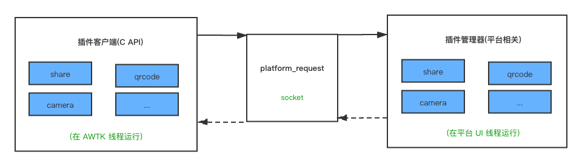

# 基本架构

插件系统由三部分组成。它们分别是：插件客户端 API、通讯组件和插件管理器。



## 插件客户端

插件客户端由用 C 语言开发，提供 C 语言的 API，供 AWTK 应用程序调用。

插件客户端的代码是平台无关的，在所有平台都可编译运行。如果该平台并未是插件机制，则执行请求之后啥也不做。

客户端 API 一般在 AWTK 的 UI 线程中调用，请求执行后，返回结果也在 AWTK 的 UI 线程中调用，在回调函数中可以直接操作 AWTK 控件。

请参考 [插件客户端](plugin_client.md)

## 通讯组件

通讯组件由 platform\_request 进行包装，插件客户端只需调用 platfor\_request\_send 即可。

```c
/**
 * @method platform_request_send
 * @annotation ["static"]
 *
 * 发送请求。
 * @param {const char*} target 目标名称。如"camera"代表相机。
 * @param {const char*} action 动作名称。
 * @param {const char*} args 参数。
 * @param {platform_request_on_result_t} on_result 完成时的回调函数。
 * @param {void*} on_result_ctx 完成时的回调函数的上下文。
 *
 * @return {ret_t} 返回 RET_OK 表示成功，否则表示失败。
 */
ret_t platform_request_send(const char* target, const char* action, const char* args,
                            platform_request_on_result_t on_result, void* on_result_ctx);
```

插件参数格式，不做硬性限制，保证客户端和服务端一致即可，但是建议采用 json 格式。

## 插件管理器

插件管理器的主要功能为：

* 插件的注册。
* 插件请求的分发。
* 执行结果的返回。

awtk-android 和 awtk-ios 的 create_project.py，会根据 app 引用的插件生成注册插件的代码。

插件管理器一般是在平台的 UI 线程执行。平台的 UI 线程和 AWTK 的 UI 线程可能是不同的，也可能是相同的。

## 插件实现

插件要实现特定的接口，一般是执行任务并返回结果。android 和 ios 实现方式有些差异。请参考：

* [android 插件实现](plugin_android.md)

* [ios 插件实现](plugin_ios.md)

