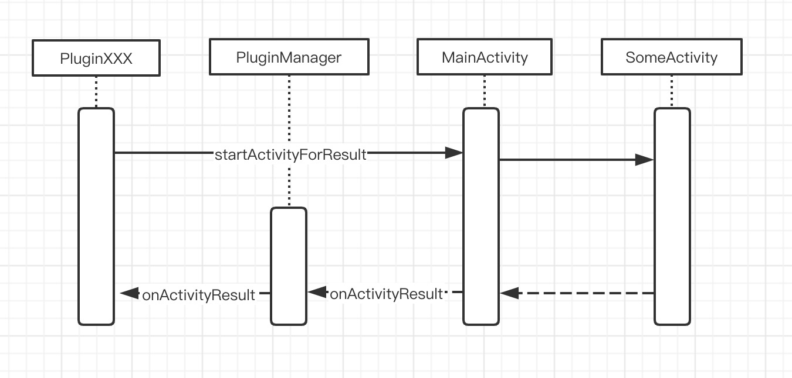

# android 平台插件实现。

android 平台的插件需要实现下面的接口 (Plugin.java)：

```java
/**
 * 插件接口。
 * 
 * @version 1.0
 */
public interface Plugin {
  /**
   * 销毁插件。
   * 
   * @return 无。
   */
  public void destroy();

  /**
   * 匹配指定的请求码是否由本插件发出。
   * 
   * @param requestCode 请求码。
   * @return 请求码是否由本插件发出。
   */
  public boolean matchRequest(int requestCode);

  /**
   * 执行指定的 action。
   * 
   * @param action     动作名称。
   * @param callerInfo 调用者的信息，用于返回结果。
   * @param args       参数。一般用 json 格式。
   * 
   * @return 是否执行成功。
   */
  public boolean run(String action, String callerInfo, String args);

  /**
   * 当请求是由另外一个 Activity 执行时，执行完成后调用本函数返回执行结果。
   * 
   * @param requestCode 请求码。
   * @param resultCode  结果码。
   * @param data        返回的数据。
   * 
   * @return 无。
   */
  public void onActivityResult(int requestCode, int resultCode, Intent data);
}
```

之所以需要 matchRequest 函数和 onActivityResult 函数，是因为 android 通常都是请求另外一个 Activity 去支持具体的任务，执行完成后异步返回结果，接受结果的对象一般也是 Activity。所有的 Plugin 都通过 MainActivity 去启动目标 Activity，也是通过 MainActivity 去接受执行结果。其流程如下：



PluginManager 通过用 requestCode 来区分请求是由那个 Plugin 发起的。requestCode 由两部分组成：

* 高 16 位为插件的 ID。
* 低 16 位为请求 ID。

如：

检查请求是否由 plugin 发出：

```c
  public boolean matchRequest(int requestCode) {
    int id = requestCode >> 16;
    
    return this.id == id;
  }
```

生成 requestCode：

```c
    int requestCode = this.id << 16 | REQUEST_CODE_SCAN;
```

如不需要返回值，则让 matchRequest 返回 false 即可。

> 完整示例请参考 share 和 qrcode 插件。